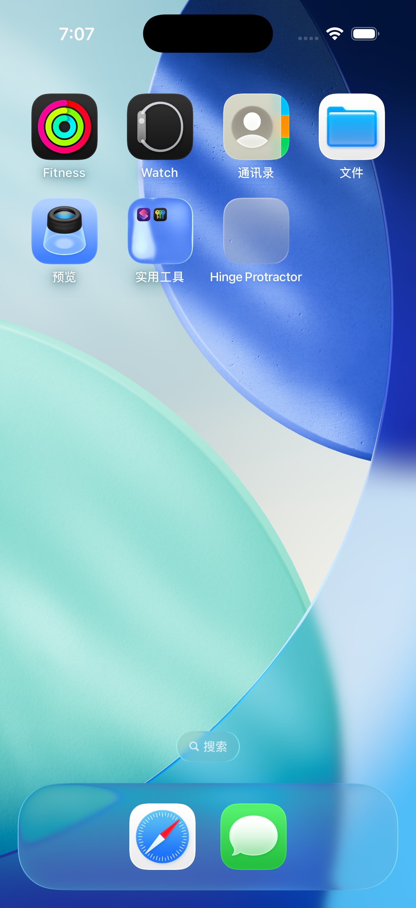

# Hinge Protractor

Open an iPhone Duo and the hinge angle is right there, read off an engraved
scale. Press the two halves against the two sides of an angle and it measures
that angle instead.



It is built as an instrument — charcoal, a single champagne accent, thin
graduated numerals, damped motion, detents every 15° so opening the device
feels like turning a machined dial. The measuring is real, but the reason to
open it is that the hinge is the one thing this device has and nothing else
does.

## Verification status

| | Status |
| --- | --- |
| Demo mode (slider input) | Built and run in iOS Simulator; 20 unit tests pass |
| Hardware hinge path | **Not verified.** Needs the iOS 27 SDK; compiled out by default |
| iPhone Duo layouts | **Not verified.** Never compiled — see below |
| Measurement accuracy | **Not measured.** No hardware has been tested |

Nothing here has run on a folding device. Do not read "demo verified" as
"hardware works".

## What it does

- Hinge angle to one decimal place — a display format, not an accuracy claim
- Set Zero / Clear Zero for relative measurement; zeroing while locked uses the
  locked reading
- Lock / unlock the reading; optional auto-lock once the angle is held still
  for a second, confirmed by haptic feedback
- Degrees and radians
- Haptic detents every 15°
- Screen stays awake while measuring, sleeps normally once locked
- No analytics, account, network access, or stored measurements

## The hardware path

The API this is built around is real. Apple's tech talk
[Leverage multiple displays and scenes on iPhone Duo](https://developer.apple.com/videos/play/tech-talks/111464/)
documents `onHingeChange`, `context.hinge`, `hinge.status` (closed /
partiallyOpen / fullyOpen) and `hinge.angle`. It ships in the **iOS 27 SDK**;
the iPhone Duo simulator arrives with **Xcode 27.1**, in beta from late
September 2026.

This was built on Xcode 26.1.1 / iOS 26.1 — one major version earlier. That SDK
declares none of those symbols (verified by searching its SwiftUI module
interfaces) and `simctl list devicetypes` offers no folding device. So the
hardware path cannot be compiled, let alone verified, here.

An earlier revision guarded the listener with `#if compiler(>=6.3)` plus
`if #available(iOS 27.0, *)`. The intent was right, but a compiler version does
not prove the selected SDK declares a symbol, and runtime availability cannot
make an older SDK resolve an interface it never had. Every reference now sits
behind one explicit build flag, `DUO_SDK_AVAILABLE`, **off by default**.

With Xcode 27.1 installed, add `DUO_SDK_AVAILABLE` to
`SWIFT_ACTIVE_COMPILATION_CONDITIONS` for the app target to compile
`DuoLayout.swift` and the hinge listener. Expect signatures to need fixing on
that first build.

### Day-one calibration

Whether the hardware reports closed as 0° or 180° is unknown. Rather than
requiring a rebuild to find out, **反转铰链方向** in the settings sheet flips it
at runtime. All coordinate conversion stays inside
`normalizeHardwareDegrees(_:)`; the raw value is kept untouched in
`lastRawHardwareDegrees` for later calibration work.

## Designing for the fold

Device geometry, from [Apple's specs](https://www.apple.com/iphone-duo/specs/):

| | Inner display | Outer display |
| --- | --- | --- |
| Diagonal | 7.6″ | 5.4″ |
| Pixels | 1878 × 2670 @ 430 ppi | 1398 × 2034 @ 460 ppi |
| Points (@3x) | ~890 × 626, landscape unfolded | ~466 × 678 |

Unfolded 164.6 × 117.8 × 5.2 mm; folded 84.1 × 117.8 × 11.3 mm; 254 g. The fold
runs vertically, so the inner display splits into halves of about **445 × 626 pt**.

Apple defines five postures on the [iPhone Duo
page](https://www.apple.com.cn/iphone-duo/): 横屏, 竖屏, 闭合, 坐立 and 站立.
Two of them matter here:

- **坐立** — folded back and set on a desk, lower half flat and upper half
  upright. This is simultaneously the measuring posture and how the device
  rests on a table. Apple's convention for it is stated plainly: 控制项就在
  底面屏幕上 — controls belong on the lower half. The layout follows that.
- **站立** — standing, which enters StandBy: clock, photos, widgets at an
  adjustable angle. The natural home for an ambient version of this app.

Note that the fold is **vertical when unfolded wide and horizontal in the sit
posture**, so the halves are left/right in one case and top/bottom in the
other. `DuoSplitLayout` reads the division region's shape and swaps
accordingly rather than assuming one of them.

Because measuring happens while the device is partially open, the inner display
is bent the entire time it is in use. Two consequences:

- **Text must not cross the crease.** It would be split across two planes
  meeting at an angle. The readout stays inside one half, and is repeated
  smaller on the other, since the halves face different directions.
- **The instrument face should cross it**, with its vertex on the fold, so the
  drawing turns about the same axis as the hardware. It is not a 1:1 overlay of
  the device — that would require looking down the hinge axis, which is
  impossible while looking at a screen mounted on it.

Layout is driven by `GeometryProxy.reservedRegions(kind: .division)` — the fold
is a *division* region, active while bent and zero-width when flat — and never
by the hinge angle, per Apple's
[adaptive layout guidance](https://developer.apple.com/videos/play/tech-talks/111463/).
`ArrangementView` is the recommended split container; this screen positions
against the region directly because one element must deliberately span the fold.

The reading is also mirrored to the cover display through `sceneAccessory`.
Which display is visible depends on whether an interior or exterior angle is
being measured — pressed into a wall corner the cover display faces the wall;
held around an outside corner the inner display does. The device cannot tell
those apart, so both show the number rather than guessing.

## Requirements

- Demo mode: Xcode 26.1.1, iOS 26.1 SDK, an iOS Simulator runtime. Verified.
- Hardware: Xcode 27.1, iOS 27 SDK, and an iPhone Duo. Not available for this work.

## Build

```bash
xcodebuild -project HingeProtractor.xcodeproj -scheme HingeProtractor \
  -configuration Debug -destination 'platform=iOS Simulator,name=iPhone 17' \
  -derivedDataPath build/DerivedData CODE_SIGNING_ALLOWED=NO build
```

Or open `HingeProtractor.xcodeproj`, pick the `HingeProtractor` scheme and a
simulator, and Run. Signing is not needed for the simulator.

## Accuracy

**Unverified.** No measurement against a reference angle has been performed.
Real-world error depends on contact between the device halves and the measured
surfaces, case thickness, mechanical play in the hinge, and where the hinge's
own zero sits. One decimal place is a formatting choice, not a precision claim.

Set Zero and calibration are different operations:

- **Set Zero** records the current displayed angle and reports change relative
  to it. Zeroing at a known 90° corner gives deviation from that corner — it
  does not correct the absolute reading to 90°.
- **Calibration** would mean correcting the absolute angle against a reference.
  This app does not do that.

## Status

Early prototype. Not a calibrated measuring instrument; not for
safety-critical or precision engineering work.

## License

[MIT](LICENSE)
